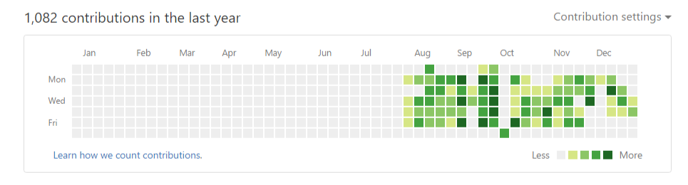

# 2016年总结

> By [kin](https://cuikangjie.github.io/resume/)

> 2016.12.31

---
> 在过去的一年里，经历了从学生转变为上班族的改变。思想上也变得更成熟了。

> 在过去的一年里，一直都工作在一家软件公司。从2015年底成为实习生进入公司以来一直到现在，工作上有时候很茫然，没有什么激情，整天就是在敲代码。在实习期间，公司的领导一直在让看别人的代码，偶尔会让改几个bug，在看别人的代码，除了能学到点书写代码的风格，其余的就是在浪费时间，并且公司的网络还有限制，不能翻墙，不能浏览各种博客。后来转正之后，一个偶尔的机会，到客户现场做外包的项目，正是因为这一次的项目开发，让我爱上了前端，并在开发之余，疯狂的学习前端知识。到现在为止，可以独立的完成各种功能的开发。

> 在这2016年的最后一天，想把自己这一年来的总结一下，但提笔之后，发觉自己并没有什么可以写的。在这最后一天里，依然比较迷茫，不知道自己想要的是什么。

---

> 希望2017年的可以一片绿！

###### 总结完毕

---

> 接下来的2017年，我会更加努力的学习前端知识。

##### 计划

* 把之前学习过的知识，巩固一下，整理成文档并且同步至博客。

* 学习vue.js。

> 目前就这两个计划了。

---
###### 啰嗦完毕，还有30分钟就是2017年了。2017年，我来了！
