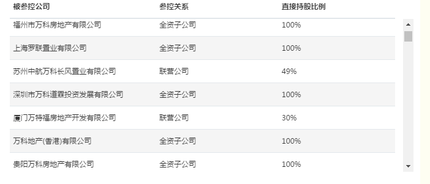

# bootstrap 表头固定

>By [kin](https://cuikangjie.github.io/resume/)

>2016.10.10

>[原文地址](https://cuikangjie.github.io/blog-kin/study/html5/bootstrap-table.html)


效果



css：
```css


//表头固定

.fixed_headers thead tr {

    display: block;
    position: relative;
}
.fixed_headers tbody {
    display: block;
    overflow: auto;
    height: 250px;
}
//每列宽度

.fixed_headers td:nth-child(1),
.fixed_headers th:nth-child(1) {

    min-width: 250px;
    text-overflow:ellipsis;
    white-space:nowrap;
    overflow:hidden;
}
.fixed_headers td:nth-child(2),
.fixed_headers th:nth-child(2) {
    min-width: 200px;
}
.fixed_headers td:nth-child(3),
.fixed_headers th:nth-child(3) {
    min-width: 200px;
}
.fixed_headers td:nth-child(4),
.fixed_headers th:nth-child(4) {
    min-width: 200px;
}
.fixed_headers td:nth-child(5),
.fixed_headers th:nth-child(5) {
    min-width: 200px;
}
.fixed_headers td:nth-child(6),
.fixed_headers th:nth-child(6) {
    min-width: 200px;
}
.fixed_headers td:nth-child(7),
.fixed_headers th:nth-child(7) {
    min-width: 200px;
}
.fixed_headers td:nth-child(8),
.fixed_headers th:nth-child(8) {
    min-width: 200px;
}
```

html:
```html
<table class="table  table-hover coma-base-table fixed_headers">
    <thead>
    <tr style="white-space: nowrap">
        <th  style="font-weight: bold;">被参控公司</th>
        <th  style="font-weight: bold;">参控关系</th>
        <th  style="font-weight: bold;">直接持股比例</th>
    </tr>
    </thead>
    <tbody>
   　　　　　　..........
    </tbody>
</table>
```
　


　　
