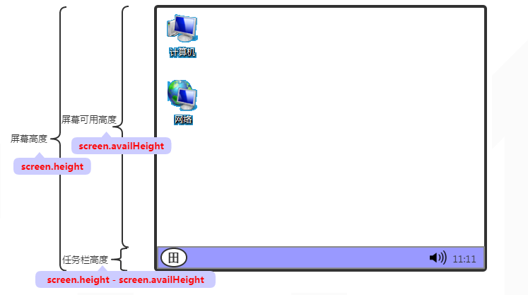
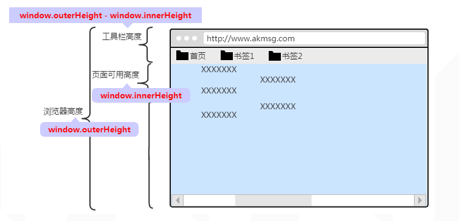
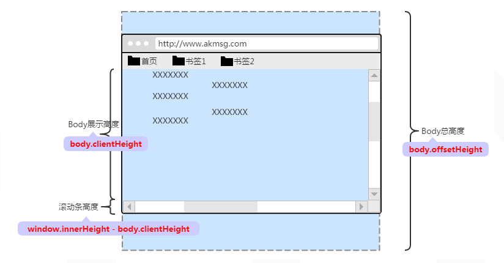

##获取屏幕、浏览器及页面的高度和宽度

>By [kin](https://github.com/cuikangjie/resume)

>2016.12.21

>[原文地址](https://github.com/cuikangjie/notes/blob/master/study/html5/screen%26window%26body%23width%26height.md)

#### 屏幕信息

>screen.height ：屏幕高度。

>screen.width ：屏幕宽度。

>screen.availHeight ：屏幕可用高度。即屏幕高度减去上下任务栏后的高度，可表示为软件最大化时的高度。

>screen.availWidth ：屏幕可用宽度。即屏幕宽度减去左右任务栏后的宽度，可表示为软件最大化时的宽度。

>任务栏高/宽度 ：可通过屏幕高/宽度 减去 屏幕可用高/宽度得出。如：任务栏高度 = screen.height - screen.availHeight 。

#### 浏览器信息

>window.outerHeight ：浏览器高度。

>window.outerWidth ：浏览器宽度。

>window.innerHeight ：浏览器内页面可用高度；此高度包含了水平滚动条的高度(若存在)。可表示为浏览器当前高度去除浏览器边框、工具条后的高度。

>window.innerWidth ：浏览器内页面可用宽度；此宽度包含了垂直滚动条的宽度(若存在)。可表示为浏览器当前宽度去除浏览器边框后的宽度。

>工具栏高/宽度 ：包含了地址栏、书签栏、浏览器边框等范围。如：高度，可通过浏览器高度 - 页面可用高度得出，即：window.outerHeight - window.innerHeight。

#### 页面信息

>body.offsetHeight ：body总高度。

>body.offsetWidth ：body总宽度。

>body.clientHeight ：body展示的高度；表示body在浏览器内显示的区域高度。

>body.clientWidth ：body展示的宽度；表示body在浏览器内显示的区域宽度。

>滚动条高度/宽度 ：如高度，可通过浏览器内页面可用高度 - body展示高度得出，即window.innerHeight - body.clientHeight。

---
[参考文档](http://www.cnblogs.com/polk6/archive/2016/01/03/5051935.html)
