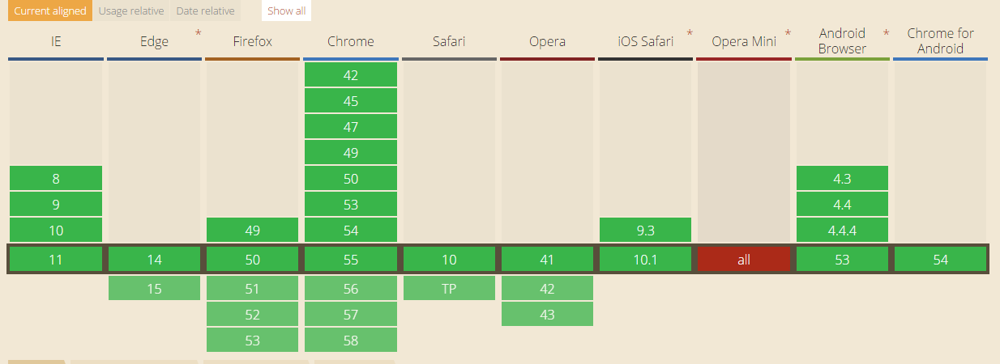

# Web Storage使用总结

#### 浏览器支持情况


#### webStorage是什么？

> Method of storing data locally like cookies, but for larger amounts of data (sessionStorage and localStorage, used to fall under HTML5).

> 一种保存数据在本地的方法像cookies一样，但用于存储大量的数据（HTML5标准下的sessionStorage 和 localStorage）

webStorage提供了localStorage 和 sessionStorage 两个api。
* localStorage
> 本地存储，除非被显示的删除，否则一直存在。数据大小为5MB。

* sessionStorage
> 只在当前会话下存在，关闭浏览器或页面后被清除。数据大小为5MB。使用方法与localStorage。


#### 使用

##### localStorage Api

* setItem(key,value)

* getItem(key)

* removeItem(key)

* clear()

* length

* key(n) 返回第n个key的名称


```javascript
var ls=window.localStorage;

// 保存数据
// 数据以string类型的保存在本地
ls.setItem('one',1);
// 取出数据
ls.getItem('one');//1
// 删除某个键值对
ls.removeItem('one');
// 删除全部
ls.clear();
// 返回本地存储的个数
ls.length;

```

##### sessionStorage Api
api和使用方法与localStorage相同
